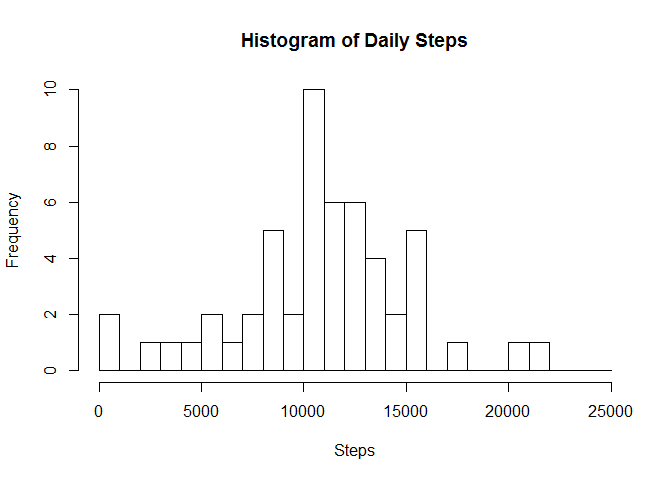

## Loading and preprocessing the data


```r
activity <- read.csv("~/GitHub/RepData_PeerAssessment1/activity/activity.csv")
#Strip out the entries with no data.
activity <- activity[!is.na(activity$steps),]
```

## What is mean total number of steps taken per day?


```r
# Calculate the day totals.
daysums <- aggregate(activity[,"steps"], by=list(date=activity$date), FUN=sum, na.rm=TRUE)
#And plot a histogram.
hist(daysums$x,breaks=seq(0,25000,by=1000), main="Histogram of Daily Steps", xlab="Steps")
```

<!-- -->

```r
#Now answer the questions.
cat("The mean number of steps per day is ",round(mean(daysums$x, na.rm=TRUE)),".\n", sep="")
```

```
## The mean number of steps per day is 10766.
```

```r
cat("The median number of steps per day is ",round(median(daysums$x, na.rm=TRUE)),".\n", sep="")
```

```
## The median number of steps per day is 10765.
```

## What is the average daily activity pattern?


```r
#Calculate the interval means.
timemeans <- aggregate(activity[,"steps"], by=list(interval=activity$interval), FUN=mean, na.rm=TRUE)
#Calculate decimal hours.
timemeans$dectime <- 100 * (timemeans$interval %/% 100 + timemeans$interval %% 100 / 60)
#And plot the means.
plot(timemeans$dectime, timemeans$x, type="l", xlab="Interval", ylab="Number of Steps", main=" Average Daily Activity Pattern")
```

<!-- -->

```r
#Now answer the question.
cat("The maximum occurs in the interval starting at ",timemeans$interval[which.max(timemeans$x)],".\n",sep="")
```

```
## The maximum occurs in the interval starting at 835.
```

## Imputing missing values


```r
#Re-read the data file.
activity <- read.csv("~/GitHub/RepData_PeerAssessment1/activity/activity.csv")
cat("The dataset had ",sum(is.na(activity$steps)), " rows with missing values.\n", sep="")
```

```
## The dataset had 2304 rows with missing values.
```

```r
# Create a column with NAs replaced with the mean for that interval.
activity$stepsi <- ifelse(is.na(activity$steps),timemeans$x[match(activity$interval,timemeans$interval)],activity$steps)

# Calculate the day totals again.
daysumsi <- aggregate(activity[,"stepsi"], by=list(date=activity$date), FUN=sum, na.rm=TRUE)
#And redo the histogram.
hist(daysumsi$x,breaks=seq(0,25000,by=1000), main="Histogram of Daily Steps (after imputation", xlab="Steps")
```

<!-- -->

```r
#Now answer the questions.
cat("The mean number of steps per day is now ",round(mean(daysumsi$x, na.rm=TRUE))," rather than ",round(mean(daysums$x, na.rm=TRUE)),".\n", sep="")
```

```
## The mean number of steps per day is now 10766 rather than 10766.
```

```r
cat("The median number of steps per day is now ",round(median(daysumsi$x, na.rm=TRUE))," rather than ",round(median(daysums$x, na.rm=TRUE)),".\n", sep="")
```

```
## The median number of steps per day is now 10766 rather than 10765.
```

```r
cat("The total number of steps has",ifelse(sum(daysumsi$x, na.rm=TRUE) > sum(daysums$x, na.rm=TRUE),"increased.","decreased."))
```

```
## The total number of steps has increased.
```

## Are there differences in activity patterns between weekdays and weekends?


```r
#Generate a column day names.
activity$day <- weekdays(as.Date(activity$date,format="%Y-%m-%d"))
#Generate a column of day types (weekend or weekday).
activity$daytype <- as.factor(ifelse((activity$day == "Saturday") | (activity$day == "Sunday"),"weekend","weekday"))

#Generage  the interval means for each day type (weekday or weekend).
timemeansi <- aggregate(activity[,"stepsi"], by=list(interval=activity$interval ,daytype=activity$daytype), FUN=mean, na.rm=TRUE)
timemeansi$dectime <- 100 * (timemeansi$interval %/% 100 + timemeansi$interval %% 100 / 60)

#Now plot the two graphs to show that they're different.
library(lattice)
xyplot(x~dectime|daytype, data=timemeansi, type="l", xlab="Interval", ylab="Number of steps",layout=c(1,2), ylim=c(0,250))
```

<!-- -->

```r
#Now answer the questions.
cat("Yep, they look different to me.  The weekend steps are more spread out through the day.")
```

```
## Yep, they look different to me.  The weekend steps are more spread out through the day.
```
